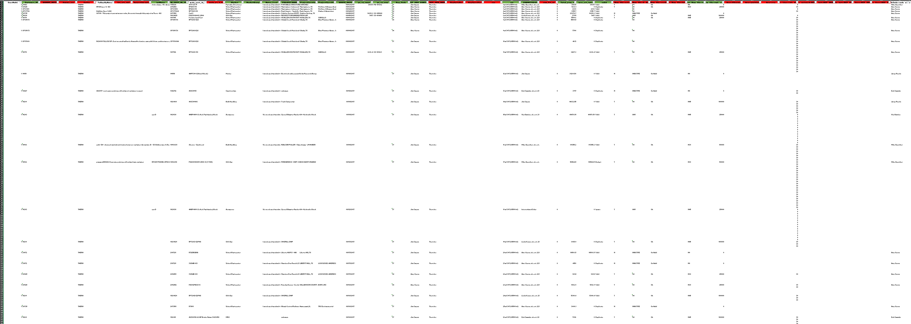
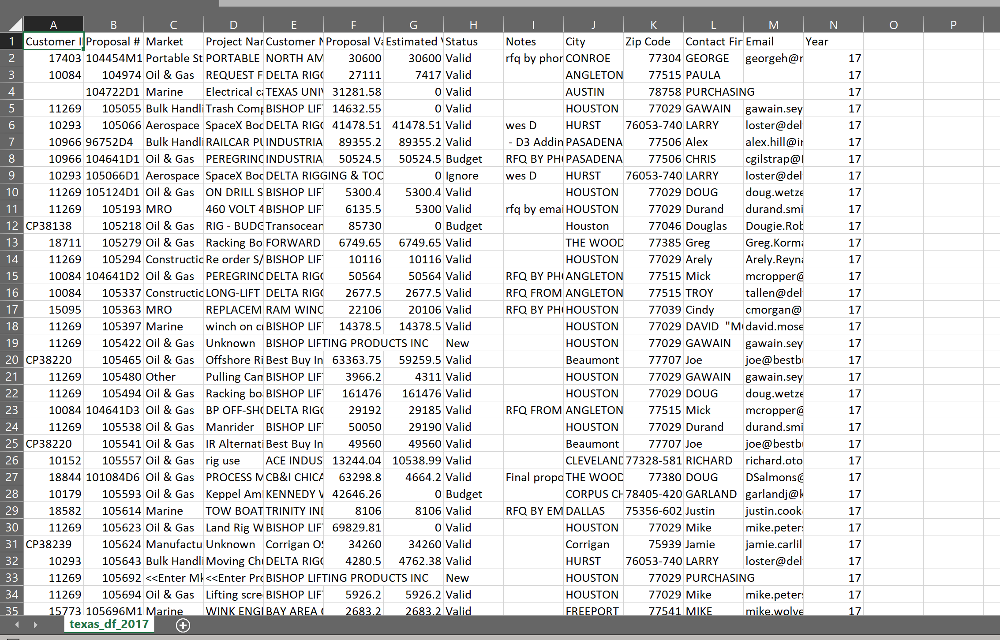
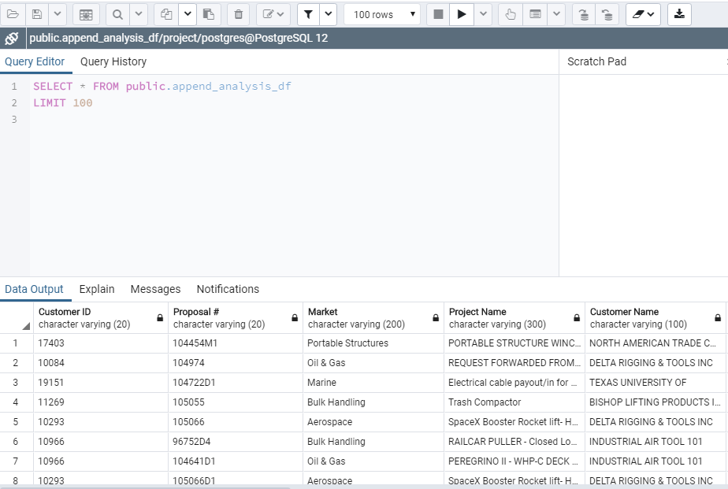
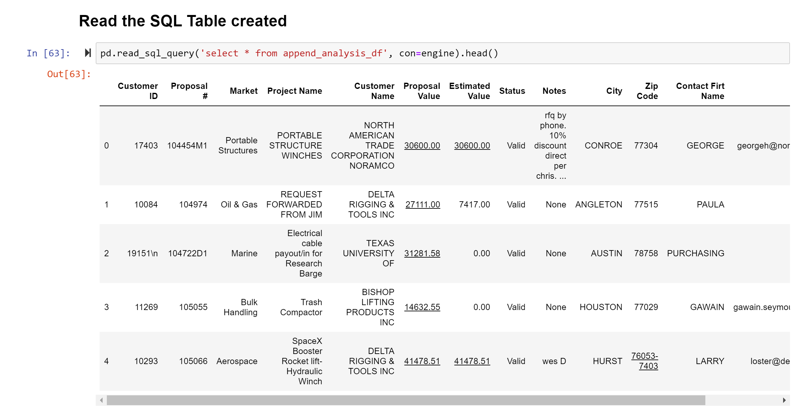
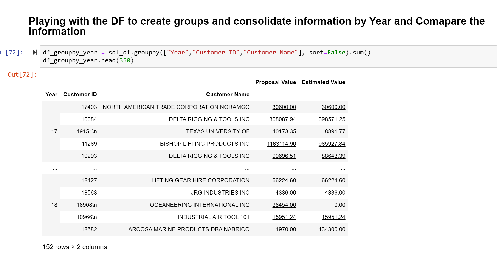

# ETL Project
## Thern Proposal Data Base Analysis

### About

*The objective of the ETL project was to Extract, Transform, & Load data from Thern Inc. proposals. We engineered data to get proposal information for both 2017 and 2018 and prepare it to be analyzed.* 

### Extracting the Data

*We extracted the data from the Thern customer database 

### Transforming the Data 

This was the most challenging part of the project due to the way the reports as generated. We had to transform a file with more than 50 columns to data frames that were manageable to the outside sales team and for the technical sales team. Also, we encounter multiple empty rows and columns that need to be dropped since they did add any value to the data frame. 

One of the main challenges we encounter while sorting, and cleaning the data was to eliminate a category withing a column that was not relevant to this case. For this instance, we used the following code:

#### Delete water waste water rows withing the data frame 
indexNames = organized_df[ organized_df['Market'] == "Water/Wastewater"].index
organized_df.drop(indexNames , inplace=True)

The different drop option for pandas would eliminate the entire row or column. 

Besides the sorting and the filtering of the data, we renamed some columns so they were easier to read and use by the individuals within the organization. 

Once we manage to read the xlsx files in pandas transform the data we wanted to combine the two years of information with the intention of been able to compare the performance of the company in terms of “proposals” generated per year. 

Our first approach was to used merge with pandas, but notice that this function at the moment of merging with an outer joint method would quadruple the number of rows in our new df. We discussed this situation and decided to used an append function to combine the two databases into one. 

In a nutshell, we transform files with having on average more than 3100 rows and approximately 70 columns to exported data frames with roughly 300 rows and 14 columns in total. Without duplicated proposals, clean and legible information ready to be uploaded. 

#### Raw Data 

#### Data Transformed 

### Loading the Data 
The last step was to transfer our final output into a [Database](http://127.0.0.1:57996/browser/). We created a database and respective table defining data types so as to match the  the columns  from the final Pandas Data Frame using Postgres database (**PGAdmin**) to store our original clean data sets. We then used the [schema](https://github.com/ruedaibanez1986/Project_ETL-/blob/master/schema.sql) to import the csv file into the SQL table. A visualization of the created database can be seen here:

We then reconnected the created database to a jupyter notebook file and generated a [pandas table](https://github.com/ruedaibanez1986/Project_ETL-/blob/master/Assets/pgadmin_connection.png?raw=true) in the notebook. 

Besides loading the data, we decided to establish a connection with the intention of validating the tables within PGAdmin were populated correctly. 

#### Validating Connection with PGAdmin table

Finally, we decided to work and play in some degree with the data group it by years with the intention of performing the analysis in terms of the numbers of proposals performed and the potential value this could generate to the company. 

#### Grouping information from df created from the connection with PGAdmin

---
### Tools Used
* Jupyter Notebook
* Python
* Pandas
* Excel Notebook
* Postgres SQL
* SQLALchemy
---

#### Team Members
* Kati Gremillion
* Robert Lugo Jr.
* Saheed Obitayo
* Kati Gremillion
